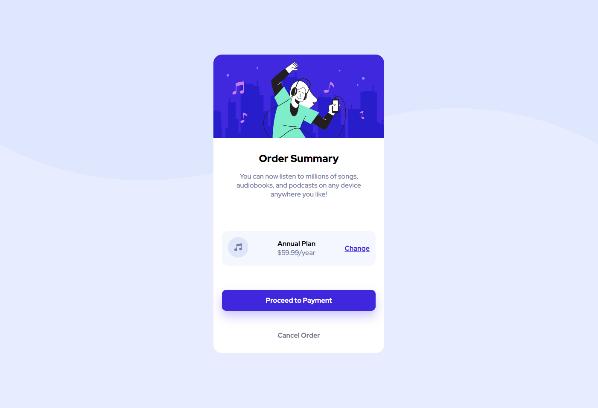

# Frontend Mentor - Order summary card solution

This is a solution to the [Order summary card challenge on Frontend Mentor](https://www.frontendmentor.io/challenges/order-summary-component-QlPmajDUj). Frontend Mentor challenges help you improve your coding skills by building realistic projects. 

## Overview

### The challenge

Users should be able to:

- See hover states for interactive elements

### Screenshot

### Links

- Solution URL: [Add solution URL here](https://github.com/frontendmentor-kelvin/order-summary-component-main)
- Live Site URL: [Link](https://frontendmentor-kelvin.github.io/order-summary-component-main/)

## My process

### Built with

- Flexbox
- Mobile-first workflow

## Author

- Website - [Kelvin](https://github.com/kelvin-lee098)
- Frontend Mentor - [@kelvin-lee098](https://www.frontendmentor.io/profile/kelvin-lee098)

